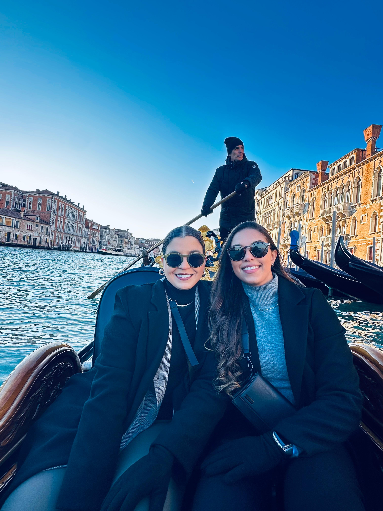
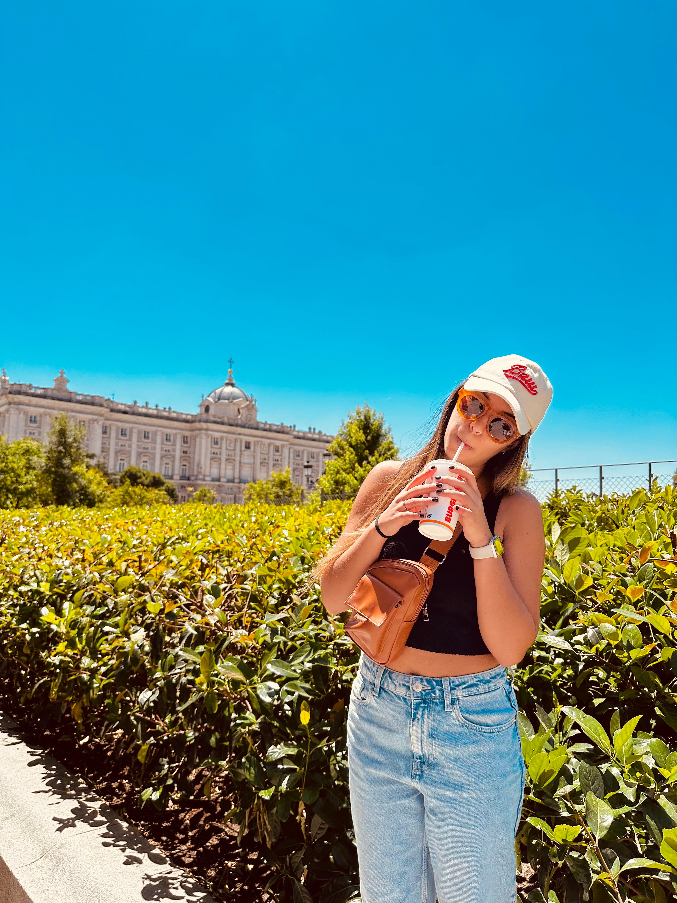
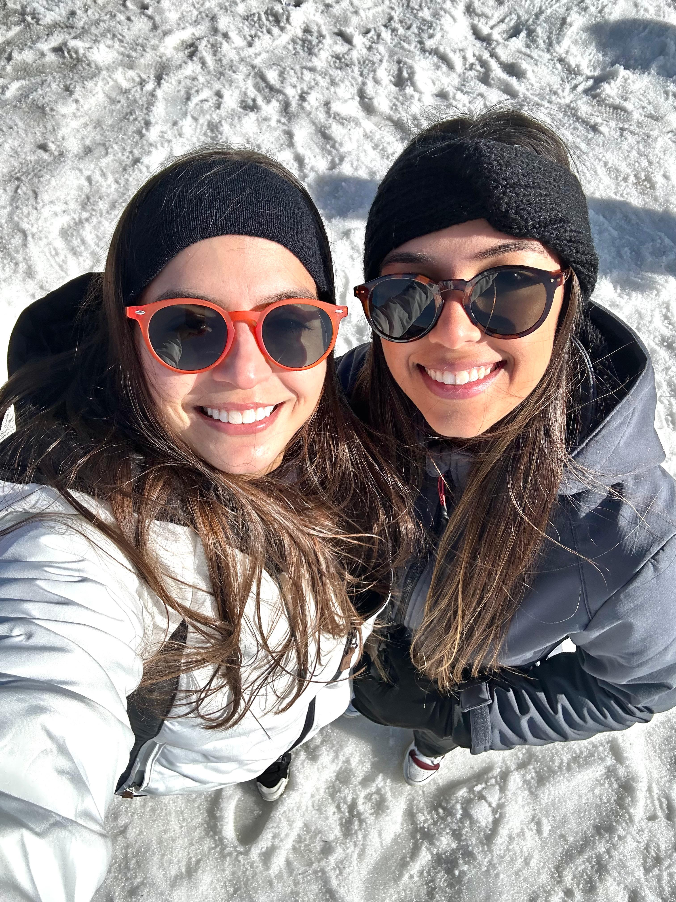
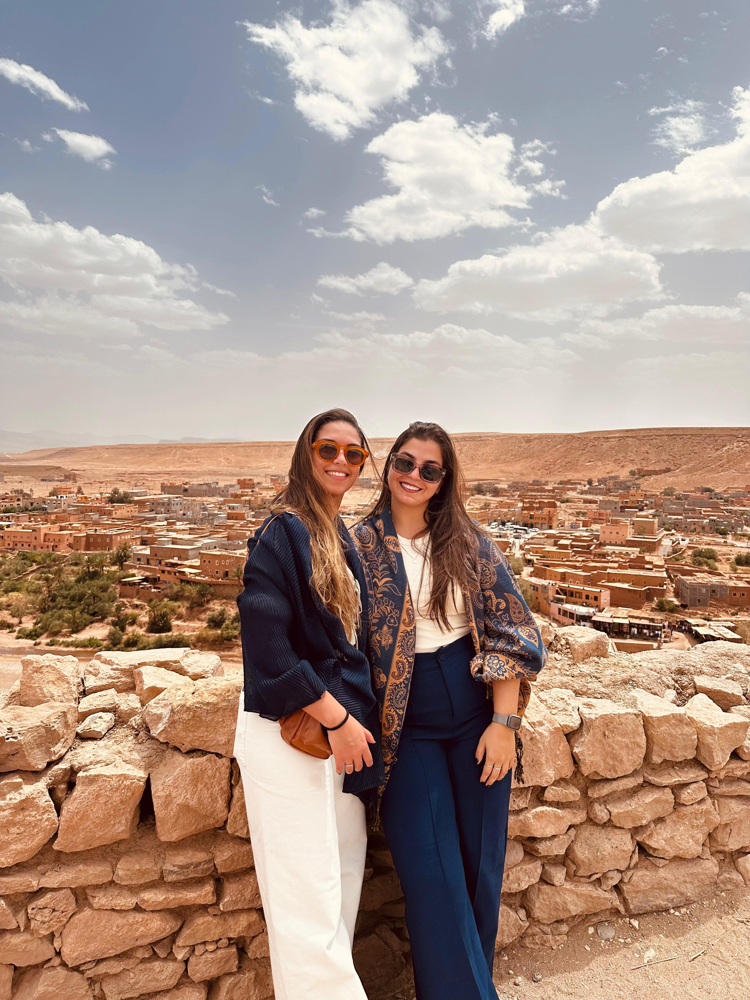
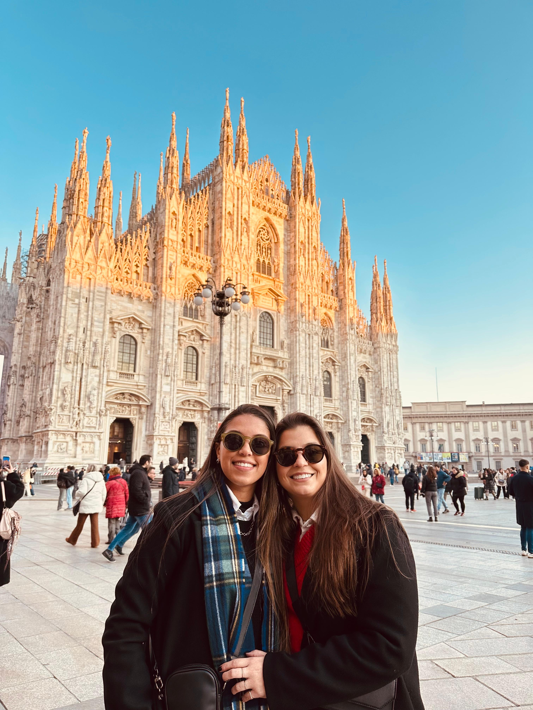

**Entrevistadora:** Carolina Motta [PG56348]  
**Entrevistada:** Vitória Ramos  

**Descrição:**  
Entrevista sobre a nossa história de amor, com perguntas e respostas que revelam momentos importantes do nosso relacionamento à distância.

**Unidade Curricular:**  
Análise e Visualização de Dados – Mestrado em Humanidades Digitais

---

## Um Oceano de Amor 🧡

**Entrevistadora**: Oi, boa noite.  
**Entrevistada**: Oi, boa noite.

**Entrevistadora**: Eu te chamei aqui pra fazer uma entrevista com você, cujo tema é a nossa história de amor. Pra isso, eu queria pedir inicialmente pra você se apresentar.  
**Entrevistada**: Meu nome é Vitória Ramos, tenho 26 anos, moro em Portugal, mas sou brasileira e estou aqui já há três anos. E sou sua namorada.

**Entrevistadora**: Perfeito, Vitória. Sobre a nossa história, você se lembra da primeira mensagem ou conversa que tivemos pela internet?  
**Entrevistada**: Sim, lembro. Foi pelo Instagram, depois que eu comentei uma foto sua. Passados uns dias, você me mandou uma cantada e depois disso, começamos a conversar pelo Instagram, depois eu pedi seu número e começamos a trocar mensagens também pelo WhatsApp.

**Entrevistadora**: E nesse começo, o que te chamou atenção em mim?  
**Entrevistada**: O que me chamou atenção em você foi sua atenciosidade. A gente estava sempre trocando mensagens, dividindo tudo e compartilhando momentos, mesmo de longe. Você sempre se fez presente nisso e foi uma das coisas que mais me chamou atenção em você.

**Entrevistadora**: Você já imaginava que algo sério poderia surgir?  
**Entrevistada**: Eu não imaginava que fosse dar tão certo, até pela distância que tinha e tudo, mas conforme íamos conversando, isso foi ficando bem claro que podia se tornar algo a mais.

**Entrevistadora**: Quem foi a primeira pessoa que você contou que estava conversando comigo naquela época e o que ela disse?  
**Entrevistada**: A primeira pessoa...

**Entrevistadora**: Está tudo bem, pode continuar.  
**Entrevistada**: A primeira pessoa que eu contei de você foi minha prima, que mora na Califórnia, nos Estados Unidos. A gente chegou a comentar porque as primeiras fotos que eu vi sua, assim, curtir, quando já rolava uma intenção, foi quando você estava na Califórnia. E depois disso, ela... que a gente comentou tudo, ela falou que ela ficaria muito feliz, se desse muito certo, até mesmo pelo fato de achar que você estava lá e ia ficar também mais próxima dela.

**Entrevistadora**: Qual foi o momento em que você percebeu que queria mesmo investir nesse sentimento?  
**Entrevistada**: Mesmo com o oceano entre a gente. Foi depois do primeiro contato que tivemos presencialmente. Tudo fluiu muito natural, como se já nos conhecíamos. E compartilhar cada momento, estar presente me fez perceber que queria viver mais daquilo com você.

**Entrevistadora**: E por falar no nosso encontro presencial, o que você mais esperava desse nosso primeiro encontro?  
**Entrevistada**: Eu esperava que fosse como nas nossas conversas. Que tivéssemos uma boa sintonia, que você fosse realmente você, e que da mesma forma que eu já tinha um sentimento, que você sentisse o mesmo ao me ver.

**Entrevistadora**: Você ficou nervosa antes do nosso primeiro encontro? E quando você me viu pela primeira vez, o que você sentiu?  
**Entrevistada**: Eu fiquei muito nervosa e ansiosa. Ainda mais quando eu saí do desembarque, você estava me esperando na porta errada. Por um segundo, achei que não fosse me encontrar, mas depois nos encontramos. E te ver vindo na minha direção foi algo surreal e mágico. A sensação depois disso é que todo o tempo longe valeu a pena. Era uma sensação de paz, tranquilidade, de estar perto de você.

**Entrevistadora**: O que você lembra com mais carinho daquele dia, além do momento que a gente se encontrou?  
**Entrevistada**: Nesse dia, o momento em que te vi. Mas dos meus dias no Brasil, o momento que eu lembro com mais carinho foi a primeira vez que disse que me amava. Estávamos com seus amigos e família, que são importantes também na sua vida. E isso tornou ainda mais aquele momento significativo pra mim.

**Entrevistadora**: Teve alguma coisa que te surpreendeu em mim, pessoalmente? Seja pro bem ou pro mal?  
**Entrevistada**: Não, nada me surpreendeu em você. Seria exatamente como eu esperava.

**Entrevistadora**: Se você pudesse reviver aquele momento em que a gente se encontrou ou os dias que você passou no Brasil, faria algo diferente?  
**Entrevistada**: Eu não faria nada diferente.

**Entrevistadora**: Como é pra você olhar pra trás pra tudo que a gente viveu, pro relacionamento à distância e hoje saber que hoje eu estou aqui, dividindo o mesmo teto e a vida bem perto de você?  
**Entrevistada**: É incrível poder hoje viver essa etapa com você. Fazer parte dos seus dias, estar presente, poder cuidar e ajudar. Ficamos um bom tempo longe e hoje aproveitamos cada minuto que estamos juntas. É incrível acordar e saber que tenho você aqui, não só pra dividir a rotina, mas pra desfrutar da vida. E todos os dias eu agradeço por viver algo tão bom com você.

**Entrevistadora**: Qual foi o momento difícil que passamos juntas e que te mostrou que fomos fortes? Aliás, que somos fortes juntas?  
**Entrevistada**: O momento mais difícil que passamos foi o período em que estávamos distantes. Então perdíamos muitas coisas importantes como aniversários, momentos especiais e o prazer de estar perto. Mas mesmo com isso, sempre fazíamos questão de se fazer presente, com alguma surpresa, ligações, mensagens, da forma que conseguimos.

**Entrevistadora**: Qual hábito ou jeito meu você achou estranho no começo, mas agora já se acostumou e até gosta?  
**Entrevistada**: Você tem um jeito peculiar de dormir. Conforme vai se mexendo à noite, o cabelo fica todo bagunçado. E eu, por ter sono leve, às vezes me assustava quando virava pro seu lado. No começo era um pouco assustador, mas com o tempo eu fui me acostumando.

**Entrevistadora**: O que mais te faz sentir amada no nosso dia a dia?  
**Entrevistada**: O que mais me faz sentir amada no nosso dia a dia é o cuidado que você tem comigo. Não só quando estou doente ou com os nossos afazeres, mas de forma geral. É muito bom saber que tem alguém aqui pra você em todos os momentos, sejam bons ou ruins.

**Entrevistadora**: O que você mais admira em mim?  
**Entrevistada**: Tem diversas coisas que eu acho admirável em você. Uma delas é como você se preocupa e cuida de todos que ama. Família, amigos e eu. Você é aquela pessoa que todos podem contar quando precisa. Também admiro sua determinação em fazer as coisas darem certo. Sua positividade, honestidade, inteligência e várias outras.

**Entrevistadora**: Quando você pensa no nosso futuro, o que vem à sua mente?  
**Entrevistada**: Sobre o futuro, primeiramente eu espero que estejamos juntas e que continuemos fazendo as coisas darem certo com respeito, empatia e admiração.

**Entrevistadora**: Que conselho você daria para casais que estão começando uma história de distância, assim como a nossa?  
**Entrevistada**: Para os casais que estão começando uma relação a distância, eu diria para terem paciência, planejamento juntos para se ver com uma data certa de encontro, que compartilhem sobre o dia a dia e cada momento, porque isso faz toda a diferença. É difícil, mas se existe um sentimento, a distância vai ser só um detalhe.

---

## 💘 Quiz do casal:

**Entrevistadora**: Agora, eu separei algumas perguntas que eu denominei como quiz do amor. São perguntas curtas, em tese com respostas rápidas e objetivas, você ou eu. Mas, eu gostaria que você justificasse a sua resposta. Então, eu vou te fazer uma pergunta, você me diz se é você ou se sou eu e por quê. Ok?  
**Entrevistada**: Ok.

**Entrevistadora**: Quem dorme mais?  
**Entrevistada**: Você. Porque qualquer cantinho aconchegante, você deita e dorme. E nem precisa ser aconchegante.

**Entrevistadora**: Quem cozinha melhor?  
**Entrevistada**: Eu cozinho melhor. Porque eu estou sempre fazendo as coisinhas que você gosta de comer.

**Entrevistadora**: Quem é mais bagunceira?  
**Entrevistada**: Nenhuma. Tanto você quanto eu não somos muito organizadas em tudo.

**Entrevistadora**: Quem manda mensagem primeiro na maioria das vezes?  
**Entrevistada**: Você. Porque eu sou mais orgulhosa.

**Entrevistadora**: Quem tem a risada mais engraçada?  
**Entrevistada**: Você. Por quê? Não.

**Entrevistadora**: Quem é mais carinhosa?  
**Entrevistada**: Vou considerar que eu sou mais carinhosa. Você também é, mas o seu carinho é um pouco bruto.

**Entrevistadora**: Quem é mais ciumenta?  
**Entrevistada**: Eu sou mais ciumenta. Porque você é uma pessoa muito tranquila.

**Entrevistadora**: Quem é mais engraçadinha?  
**Entrevistada**: Eu sou mais engraçada. Apesar de que você também tem um bom humor.

**Entrevistadora**: Quem lembra mais datas importantes?  
**Entrevistada**: Nós duas lembramos.

**Entrevistadora**: Quem é mais fitness?  
**Entrevistada**: Você é mais fitness. E eu gosto de tudo muito salgadinho.

---

**Entrevistadora**: Então, eu gostaria de te pedir para descrever a nossa relação. O que nós somos para você?  
**Entrevistada**: Somos a junção de duas pessoas que se amam muito. Diferentes, mas que combinam em muitas coisas. A junção de tudo que eu sempre quis viver e nem sabia que precisava. Estar com você faz com que eu me sinta bem. Saber que eu posso ser o mesmo é incrível. Nós nos conhecemos em todas as nossas particularidades, com todas as qualidades e defeitos. E ainda assim escolhemos uma à outra. Somos amigas, namoradas e parceiras de vida. E eu te amo.

 🧡
